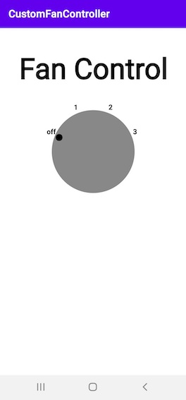
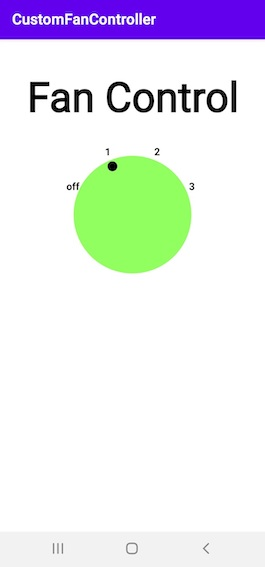

# :art: Custom View Object - CustomFanController

This is the toy app for Lesson 4 of the Advanced Android Apps with Kotlin course on [Udacity](https://www.udacity.com/).

## :wind_face: CustomFanController 

CustomFanController is an example about how to create a CustomView with Kotlin! The user can intercat with the CustomView and click on it in order to switch to a higher level.

This app demonstrates the following views and techniques:

* @JvmOverloads annotation to to generate overloads for this function that substitute default parameter values.
* View Class to access the onDraw() and the onSizeChanged methods.
* Canvas Class to make the drawing possible for the user.
* Paint Class to implement basic styles to the CustomView.
* Extension Functions to access specific method from a Class.

## :camera_flash: Screenshots

